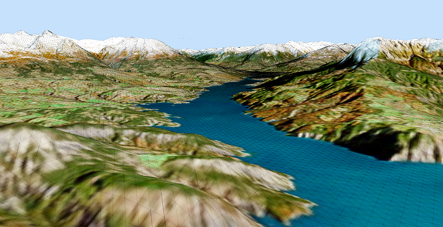

# KoreGlobe

**KoreGlobe** is a real-time 3D globe application built with [Godot Engine](https://godotengine.org/) using C#. It provides a foundation for visualizing global terrain, imagery, and geospatial data in an interactive, scalable environment.

## Features

- 🌍 Realistic 3D globe rendering
- 🛰️ Support for satellite imagery and elevation data
- 🗺️ LOD-based tile streaming and culling
- 🧭 Lat/Lon/Alt position system with smooth camera navigation
- 🛠️ Built entirely in C# using Godot's .NET support




## Getting Started

### Prerequisites

- [Godot 4.x](https://godotengine.org/download) with .NET support
- .NET 6 or later SDK
- Git

### Build and Run

```bash
git clone https://github.com/KORE74/KoreGlobe.git
```
Open the project in Godot and build/run the main scene.
A map library of pre-prepared data is available separately.
